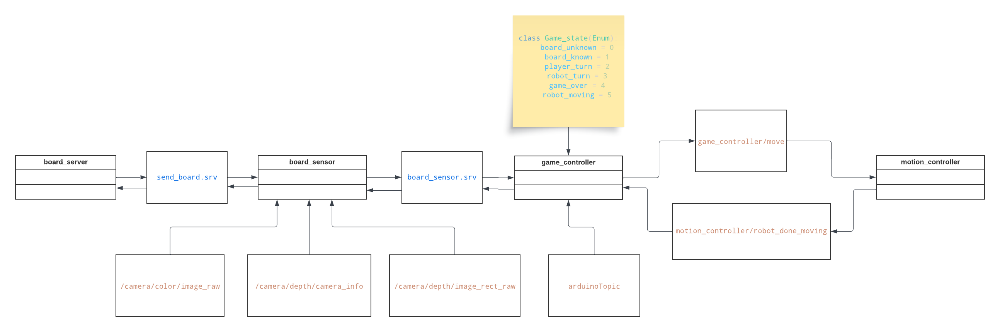

# chess_mate
<div id="header" align="center">
  
  
  
 </div>
A chess-playing robot arm adept at analyzing and engaging with diverse board positions using object detection and traditional computer vision methods.


- [Introduction](#introduction)
- [Dependencies](#dependencies)
- [Installation](#installation)
- [Project Outline](#project-outline)
- [Game Controller](#game-controller)
- [Computer Vision](#computer-vision)
- [Motion Controller](#motion-controller)
- [Future Improvements](#future-improvements)
- [Author(s)](#authors)

## Dependencies
- [franka_ros](https://frankaemika.github.io/docs/installation_linux.html)
- [stockfish](https://stockfishchess.org/download/linux/)
- [python-chess](https://pypi.org/project/python-chess/)
- OpenCV
- [realsense-ros](https://github.com/IntelRealSense/realsense-ros)
- [MoveIt](https://moveit.ros.org/install/)
- [rosserial](https://microcontrollerslab.com/rosserial-arduino-setup-ros-node/)
- [ros-control](https://github.com/ros-controls/ros_control)
- [ultralytics](https://github.com/ultralytics/ultralytics)

## Installation
Firstly, install this repo: ```git clone https://github.com/METU-KALFA/chess_mate```

- Start Ubuntu 20.04 real-time kernel which is in advanced settings in grub menu.
- Turn on the Franka Emika’s computer and make sure the internet cable plug in between Franka Emika’s computer and your computer.
- Run Firefox browser then go https://10.0.0.2 , firstly you must open joints brake then you must click Activate FCI all these settings are in right side menu.
- Now, enter the these commands on different terminals;

#### To launch robot control
```
cd ~/franka_ros2
source devel/setup.bash
roslaunch franka_control franka_control.launch robot_ip:=10.0.0.2
```
#### To launch moveit
```
cd ~/panda_chessmate/FrankaRos
source devel/setup.bash
roslaunch panda_movit_config move_group.launch arm_id:=panda load_gripper:=true
```
#### To visualize robot
```
rviz
File > Open Config > Home > panda_demo.rviz
```
#### To launch camera
```
roslaunch realsense2_camera rs_camera.launch rgb_camera.color_format:=RGB8
```
#### To communicate Arduino with ROS
```
rosrun rosserial_arduino serial_node.py _port:=/dev/ttyUSB0   #check your port
```
#### Run Python scripts (3 different terminal)
```
cd ~/pandachess_ws
source devel/setup.bash
rosrun panda_chess motion_controller
```
```
cd ~/pandachess_ws
source devel/setup.bash
rosrun panda_chess board_sensor
```
```
cd ~/pandachess_ws
source devel/setup.bash
rosrun panda_chess game_controller
```
### Second computer
This computer used for run YOLOv8 and publish chess board information.

Clone this branch: ```git clone -b second_computer_ws https://github.com/METU-KALFA/chess_mate```

#### Set ROS communication settings between main PC to get chessboard data;
```
gedit ~/.bashrc
export ROS_MASTER_URI=http://10.0.0.1:11311
export ROS_IP=10.0.0.4
```
#### Run python script
```
source home/kovan4/anaconda3/bin/activate
conda activate chessMate
cd ~/chess_ws
source devel/setup.bash
cd ~/chess_ws/src/panda_chess/src
python3 board_server.py
```


### Project Outline



### Game Controller
- Keeps track of the game state
- Requests needed board information from board_sensor
- Picks the best move for the robot using the Stockfish engine
- Handles special chess rules such as castling, piece promotion, and en passant.
- Detects the player move after the button is pressed. If move is not valid due to piece detection errors, program will prompt you to 		  enter a move from the terminal
- Sends the pick and place positions to move_controller


### Computer Vision
#### First Step: Chessboard Detection
- The image is resized as 640x640 to be prepared for object detection.
- Chessboard is detected by machine learning model prepared using YOLOv8 object detection algorithm.
- The image is cropped by the taken data from the object detection model.
 <div id="header" align="center">
  
  
  
  
  
 </div>
 
#### Second Step: Preparing Image
- Adaptive threshold is applied to the image.
- All contours are found and the biggest contour is selected.
- Outer corner points of the image is found by the selected contour.
 <div id="header" align="center">
  
   
  
  
 </div>
 
#### Third Step: Perspective Transform
- According to found corner points, perspective transform matrix M is found by cv2.perpectiveTransform() and perspective transform is applied to the image by cv2.warpPerspective().
- In the bird-view image, all four corner points of every square are found and transformed a list.
 <div id="header" align="center">
  

  
 </div>
 
#### Fourth Step: Inverse Perspective Transform
- By using the inverse matrix of the perspective transform matrix, four corner points of every square are transformed back to the original perspective.
- By mathematical operations, center points of every square are found.
<div id="header" align="center">
  
 </div>
 
#### Fifth Step: Back to the Original Image
- Thanks to knowing the top left corner pixel coordinate of the boundary box of detected chessboard, the cropped image with center points is tranformed back to the resized version of the original image.
- By scaling the resized image, the original image with center points is obtained.
<div id="header" align="center">
  

  

 </div>

#### Weights for piece and board detection
Board detection: https://drive.google.com/drive/folders/1Q814KcSBCfySLgavn4tyzaaHBehxSmb8?usp=drive_link

Pieces detection: https://drive.google.com/drive/folders/1nWCjnJWY0MIILTfV6DDCxnoSCoZ2IwSv?usp=drive_link


### Motion Controller
The robotic manipulator control was provided by **MoveIt** which has a Motion Planning and Inverse Kinematic Solver plugins. 
Some MoveIt features;

#### Easy to Use Setup Assistant
Quickly setup Franka Emika robot to work with MoveIt with the step-by-step configuration wizard. Also includes configuration of Gazebo and ROS Control.
- [Click](https://ros-planning.github.io/moveit_tutorials/doc/setup_assistant/setup_assistant_tutorial.html) for tutorial on official website.
- [Click](https://youtu.be/9aK0UDBKWT8?si=FUEB8u72IYgqucdN) for YouTube tutorial.
<div id="header" align="center">
  
 </div>

#### 3D Interactive Visualizer
Rviz is the primary visualizer in ROS and an incredibly useful tool for debugging robotics. Before end effector of robotic arm reach target point, planning scenario shows up on Rviz.
<div id="header" align="center">
  
 </div>

 #### Gazebo Simulation
 Physics-based simulator needed to speed up development and testing of codes. Combine Gazebo, ROS control packages, and MoveIt we simulated robotic manipulator.
 <div id="header" align="center">
  
 </div>


## Future Improvements
- Improve piece detection model
- Pixel to world coordinates implemented but not working correctly. For now we keep the board fixed.
- After fixing step 2, will need to test piece promotion to make sure the model can detect pieces outside of the board and their coordinates and make the correct set of moves to promote a piece
- Test if robot can make an en passant move, and if it can recognize if a player makes an en passant move
- Test if the robot can make a castling move

## Author(s)
[Feyza Nur SÖĞÜT](https://github.com/feyzasogut), [Ekin ERÇETİN](https://github.com/ekin-e), [Zeynep Berda AKKUŞ](https://github.com/berda-ak), [Gürsel TÜRKERİ](https://github.com/gurselturkeri)
## Acknowledgements
- https://blog.roboflow.com/how-to-train-yolov8-on-a-custom-dataset/
- https://docs.ultralytics.com/usage/python/#track
- https://ros-planning.github.io/moveit_tutorials/
- https://ros-planning.github.io/moveit_tutorials/doc/move_group_python_interface/move_group_python_interface_tutorial.html
- http://docs.ros.org/en/noetic/api/moveit_commander/html/namespacemoveit__commander.html

